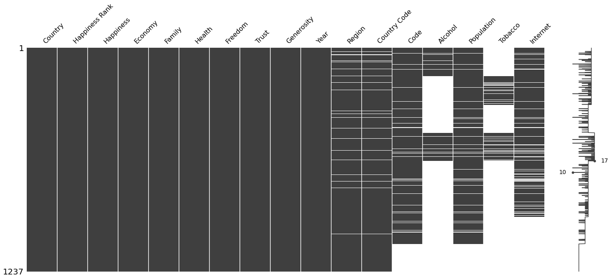
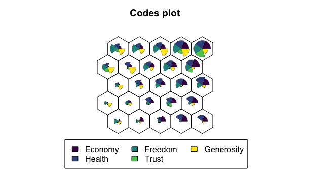
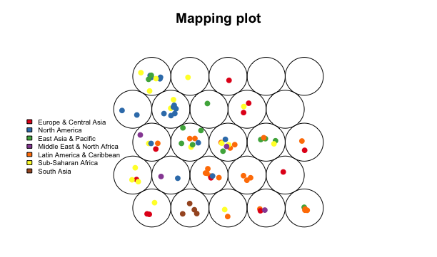

```{r setup, include=FALSE}
knitr::opts_chunk$set(echo = TRUE)
library(knitr)
library(kableExtra)
library(plotly)
library(scales)
library(GGally)
library(reshape2)
library(car)
require("glmnet")

```

## Opening Questions
### What influences happiness?
### Happiness over time?

## Datasets and pre-processing

Our base dataset is the [World Happiness Report](https://www.kaggle.com/datasets/mathurinache/world-happiness-report) ranging from 2015 to 2022. The World Happiness Report is a publication of the United Nations Sustainable Development Solutions Network. It contains articles and rankings of national happiness, based on respondent ratings of their own lives, which the report also correlates with various life factors.
The dataset contains 12 columns, 1237 rows and can be seen in the table below. 
As our goal is to analyse the factors of happiness, the following six columns are most important for us: GDP, Family, Health, Freedom, Corruption and Generosity.
```{r, echo=FALSE}
h_sample_2015 <- read.csv(file = './data/happy/2015.csv')
kable(h_sample_2015[1:3,], "html") %>% kable_styling("striped") %>% scroll_box(width = "100%")
```

In addition, we wanted to add futher factors and added the following three datasets:

* [smoking dataset](https://ourworldindata.org/smoking): 
* [alcohol dataset](https://www.kaggle.com/datasets/pralabhpoudel/alcohol-consumption-by-country?resource=download)
* [internet dataset](https://data.worldbank.org/indicator/IT.NET.USER.ZS)

By merging the datasets we have now four additional factors:

* Prevalence of current tobacco use (% of adults)
* Population (historical estimates)
* Total alcohol consumption per capita (liters of pure alcohol, projected estimates, 15+ years of age)
* Individuals using the Internet (% of population)

To join all the different datasets we had to do some manual preprocessing which can be seen in the [preprocessing](./preprocessing.ipynb) step.
The main steps where cleaning the data (region, countrycode, NaN) and joining the datasets based on the year and the countrycode.

After joining we noticed, that the three additional data sets do not contain data for the whole timespan 2015-2022.(fig. missing values full data)
Therefore, we decided to create two datasets. One for analysing the happiness change over time and one for analysing the influential factors regarding happiness in only one year.

For the first dataset, the [over time analysis]("./data/preprocessed_data_happy_incl_region_no_nan.csv"), we only included the 6 factors from the base happiness dataset and excluded all rows containing missing values. We also renamed the columns for having shorter labels.
```{r, echo=FALSE}
data_over_time <- read.csv(file = './data/preprocessed_data_happy_incl_region_no_nan.csv')
kable(data_over_time[1:3,3:ncol(data_over_time)], "html") %>% kable_styling("striped") %>% scroll_box(width = "100%")
```


For the second dataset, the [influential factors analysis]("./data/preprocessed_data_2018_no_nan.csv"), we inspected the missing values of each year and choose the year with the lowes missing values, year 2018 (fig "missing values 2018"). Then we excluded all rows containing missing values again. Figure "missing values 2017" shows e.g. that the smoking and the alcohol dataset did not contain any values for the year 2017.  We also renamed the columns for having shorter labels.

```{r, echo=FALSE}
data_2018 <- read.csv(file = './data/preprocessed_data_2018_no_nan.csv')
data_2018$Region <- as.factor(data_2018$Region)
kable(data_2018[1:3,1:ncol(data_2018)], "html") %>% kable_styling("striped") %>% scroll_box(width = "100%")
```




## Preliminary analyses

One of the objectives of preliminary data analysis to get a feel for the data you are dealing with by describing the key features of the data and summarizing the results. We are focusing on the second dataset, the [influential factors analysis dataset]("./data/preprocessed_data_2018_no_nan.csv"), as it contains the most explanatory variables.

### Boxplots, scale data?
```{r echo=FALSE}
correlation_categories <- c("Happiness","Economy","Family","Health","Freedom","Trust","Generosity","Alcohol","Population","Tobacco","Internet", "Region")
```
First we check via the summary how all the explanatory variables are distributed. As we can see they are on different scales, especially "population" and "Internet usage". As we don't want to have the following analysis be more driven on the larges distances, we scale them by $\frac{(x - mean(x))}{sd(x)}$

```{r echo=FALSE, fig.height=8, fig.width=10, message=FALSE, warning=FALSE}
summary(data_2018[,correlation_categories])
```
```{r echo=FALSE, fig.height=8, fig.width=10, message=FALSE, warning=FALSE}
not_scaled_data_factors <- data.frame(data_2018[,correlation_categories[-12]])
scaled_data_factors <- data.frame(scale(data_2018[,correlation_categories[-12]]))

data_long <- melt(scaled_data_factors) 
ggplot(data_long, aes(x = variable, y = value)) +
  geom_boxplot()

```

We can see that every factor is now on the same scale. We have some outliers for Family, Freedom, Trust, Generosity and Population.

### correlation matrix

On the correlation matrix plot we see, that happiness has the stronges correlation with Economy (0.833) and Internet (0.817).
For the correlations between the explanatory variables the following stand out:

* 0.934: Economy and Internet
* 0.875: Economy and Health
* 0.864: Internet and Health
* 0.741: Family and Economy
* 0.728: Internet and Family

```{r echo=FALSE, fig.height=8, fig.width=10, message=FALSE, warning=FALSE}
ggpairs(scaled_data_factors, title="correlation matrix for influential factors analysis", )
```


### regression

One tool for getting a first glance on what influences happiness is linear regression. For the regression we use the unscaled data. If our linear model has good predictability, we can interpret the coefficients on how they influence the outcome. This is also called regression analysis, where the goal is to isolate the relationship between each explanatory variable and the outcome variable.

However, the interpretability assumes that you can only change the value of  one explanatory variable and not the others at the same time. This of course is only true if there are no correlations between the explanatory variables. If this independence does not hold, we have a problem of multicollinearity. This can result in the coefficients swingging wildly based on which other independent variables are in the model. Therefore the coefficients become very sensitive to small changes in the model and can not be easily interpreted.

One way to asses how strong the explanatory variables are affected by multicollinearity is using the variance inflation factor (VIF). VIFs identify correlations and their strength. VIFs between 1 and 5 suggest that there is a small correlation, VIFs greater than 5 represent critical levels of multicollinearity where the coefficients are poorly estimated. 

If we build a linear regression model on all explanatory variables, we get an **R-squared of 0.8303**. However, by plotting the VIF values we can see that a model based on all explanatory variables has severe multicollinearity. Therefore we can not interprete the coefficients for Internet and Economy.


```{r echo=FALSE, message=FALSE}
lm1 <- lm(Happiness ~ . , data = not_scaled_data_factors)
summary(lm1)
vif_values <- vif(lm1)
par(mar=c(2,6,2,2))
barplot(vif_values, main = "VIF Values Full Model", horiz = TRUE, col = "blue", las=1)
abline(v = 5, lwd = 3, lty = 2)

```

If we build a linear regression model without Internet and Economy, we get an **R-squared of 0.7924**. This R-squared is lower than prior, but after plotting the VIF values we can see that we are allowed to interprete the coefficients for the remaining explanatory variables.

Interesting is that only Family, Health and Tabacco is statistically significant:

* Family has an positive effect on the Happiness Score. One unit change on Family results in an absolute Happiness increase of **15.98**
* Health has an positive effect on the Happiness Score. One unit change on Health results in an absolute Happiness increase of **24.04**
* Tobacco has an negative effect on the Happiness Score. One unit change on Tobacco results in an absolute Happiness decrease of **-0.01884**

```{r echo=FALSE, message=FALSE}
lm2 <- lm(Happiness ~ . -Internet - Economy , data = not_scaled_data_factors)
summary(lm2)
vif_values2 <- vif(lm2)
par(mar=c(2,6,2,2))
barplot(vif_values2, main = "VIF Values Model -Internet & -Economy", horiz = TRUE, col = "blue", las=1)
abline(v = 5, lwd = 3, lty = 2)

```
Next we tried out the linear regrssion methods with shrinkage. For Lasso and Ridge regression all predictor variables should be scaled so that they
have the same standard deviation. Otherwise, the predictor variables have weighting in the penalty term. The glmnet() function however standardises the predictors by default and the output coefficients are recalculated to apply to the original scale.

The Ridge regression 


```{r}
x <- model.matrix(Happiness ~ . -Internet - Economy , data = not_scaled_data_factors)[, -1]
y <- not_scaled_data_factors$Happiness

"Ridge Regression"
ridge.out <- cv.glmnet(x,y, alpha = 0)
coef(ridge.out)
```

The Lasso Regression


```{r}

"Lasso Regression"
lasso.out <- cv.glmnet(x,y, alpha = 1)
coef(lasso.out)
```


### PCA (Colour by region) + biplot (or PLS)


### SOM





## How does happiness change over time?

# Animation


geography map (color each country base on the percentage change over time (2015-2022))

```{r echo=FALSE, message=FALSE}
library(knitr)
library(plotly)
library(ggplot2)
library(dplyr)
library(corrplot)


map.world <- map_data("world")

full <- read.csv('https://raw.githubusercontent.com/Oliss4t/BHT_Vizsualisation_Project/main/data/preprocessed_data.csv')

full$Country <- recode(full$Country,
                       "Congo (Brazzaville)"="Republic of Congo",
                       "Congo (Kinshasa)"="Democratic Republic of the Congo",
                       "Hong Kong"="China",
                       "Hong Kong S.A.R., China"="China",
                       "North Cyprus"="Cyprus",
                       "Palestinian Territories"="Palestine",
                       "Somaliland region"="Somalia",
                       "Trinidad and Tobago"="Trinidad",
                       "United Kingdom"="UK",
                       "United States"="USA",
                       "Somaliland Region"="Somalia",
                       "Taiwan Province of China"="Taiwan")
full <- arrange(full, Country)

full <- subset(full, select = -c(X))

names(full) <- c("country", "rank", "happiness", "economy", "family", "health", "freedom", "trust", "generosity", "year", "region", "ccode", "code", "alcohol", "population", "tobacco", "internet")

full$year <- as.factor(full$year)

#generating standardized data by year
df.5 <- filter(full, year == 2015)
df22 <- filter(full, year == 2022)

#data for change over time
df.change <- left_join(df.5,df22, by = "country")
df.change <- mutate(df.change,
                    h.diff = happiness.x-happiness.y,
                    e.diff = economy.x-economy.y,
                    f.diff = family.x-family.y,
                    he.diff = health.x-health.y,
                    fr.diff = freedom.x-freedom.y,
                    t.diff = trust.x-trust.y,
                    g.diff = generosity.x-generosity.y)
df.change <- select(df.change, country, region.x, h.diff, e.diff, f.diff, he.diff, fr.diff, t.diff, g.diff)
names(df.change) <- c("country", "region", "happiness", "economy", "family", "health", "freedom", "trust", "generosity")


for (i in 1:7) {
  df.change[,i+2] <- round(df.change[,i+2], 3)
}

map.world1 <- left_join(map.world, df.change, by = c('region' = 'country'))


#Diverging Color Palette 


###install.packages("devtools")    
### devtools::install_github("kwstat/pals")   
library(pals)
coolwarm_hcl <- colorspace::diverging_hcl(100,
                                          h = c(250, 10), c = 100, l = c(37, 88), power = c(0.7, 1.7))
ggplotchange <- ggplot(data = map.world1, aes(x = long, y = lat, group = group, fill = happiness, text  = paste("Country:", region, "<br>", "Happiness:", -happiness, "<br>", "Economy:", economy, "<br>", "Family:", family, "<br>", "Health:", -health, "<br>", "Freedom:", -freedom, "<br>", "Trust:", trust, "<br>", "Generosity:", generosity))) +
  geom_polygon() +
  scale_fill_gradientn(colors = ocean.curl(150)) +
  theme(
    panel.grid = element_blank(),
    axis.text = element_blank(),
    axis.title = element_blank(),
    axis.ticks = element_blank(),
    legend.title = element_blank(),
    plot.title = element_text(hjust = 0.5)) +
  labs(title = "Change from 2015 to 2022") +
  guides(fill = guide_legend(title=NULL))
ggplotly(ggplotchange, tooltip = c("text"))

```


## What further influences happiness?

```{r}
box <- ggplot(data_2018, aes(x = Region, y = Happiness, color = Region), ) +
  geom_boxplot() + 
  geom_jitter(aes(color=Country), size = 0.5) +
  ggtitle("Happiness Score for Regions and Countries") + 
  coord_flip() + 
  theme(legend.position="none")
ggplotly(box)
```

# Tobacco Consumption

```{r echo=FALSE, message=FALSE}
library(viridis)
library(tidyverse)
library(plotly)
library(ggpubr)
#setwd('~/Documents/M/Semester 2/Visualisation')
happy <- read.csv('https://raw.githubusercontent.com/Oliss4t/BHT_Vizsualisation_Project/main/data/preprocessed_data_2018_no_nan.csv')

data("happiness", package = "zenplots")

tobaccohappy <- left_join(as.data.frame(happiness), as.data.frame(happy[ ,c("Country","Tobacco")]), by = 'Country')

tobaccohappy <- tobaccohappy[,-7]

d <- highlight_key(tobaccohappy,
                   ~Region)

p <-ggplot(d, aes(x = Tobacco, y = Happiness, group = Region, 
                  color = Region, text = Country)) + 
  labs(y= "Happiness Score", x = "Tobacco Consumption (%)", title = "Tobacco and Happiness") + 
  geom_smooth(aes(group = Region), method = "lm", se = FALSE, size = 0.5) + 
  geom_point(aes(size = GDP)) +
  theme_bw() + 
  scale_color_manual(values = rainbow(10, alpha = 0.7)) +
  scale_size_continuous(range = c(0, 10), name = '')

gg <- ggplotly(p, tooltip = "text") %>% 
  highlight(on = 'plotly_click', off = 'plotly_doubleclick', 
            opacityDim = .05)

# First, make the lines invisible (because no groups are highlighted)
# Remove the line legend; add the point legend
invisible(
  lapply(1:length(gg$x$data),
         function(j){
           nm <- gg$x$data[[j]]$name
           md <- gg$x$data[[j]]$mode
           if(md == "lines") {
             gg$x$data[[j]]$visible <<- FALSE
             gg$x$data[[j]]$showlegend <<- FALSE
           } else {
             gg$x$data[[j]]$visible <<- TRUE
             gg$x$data[[j]]$showlegend <<- TRUE
           }
         }
  ))

gg %>% htmlwidgets::onRender(
  "function(el, x){
    v = [] /* establish outside of the events; used for both */
    for (i = 0; i < 22; i++) {  /*1st 11 are lines; 2nd 11 are points */
      if(i < 12){
        v[i] = false;
      } else {
        v[i] = true;
      }
    }
    console.log(x);
    el.on('plotly_click', function(d) {
      cn = d.points[0].curveNumber - 10;  /*if [8] is the lines, [18] is the points*/
      v2 = JSON.parse(JSON.stringify(v)); /*create a deep copy*/
      v2[cn] = true;
      update = {visible: v2};
      Plotly.restyle(el.id, update); /* in case 1 click to diff highlight */
    });
    el.on('plotly_doubleclick', function(d) {
        console.log('out ', d);
        update = {visible: v}
        console.log('dbl click ' + v);
        Plotly.restyle(el.id, update);
    });
  }")
```

## Future work
