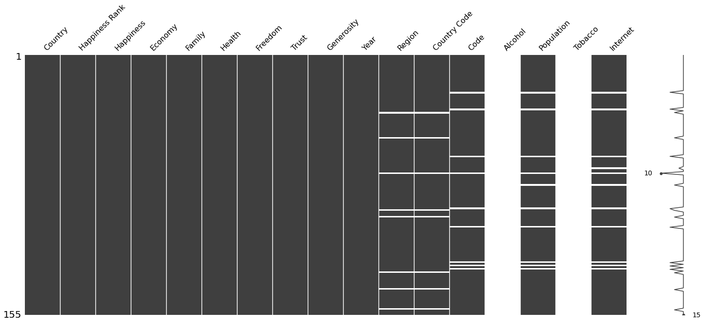

```{r setup, include=FALSE}
knitr::opts_chunk$set(echo = TRUE)
library(knitr)
library(kableExtra)
require(gridExtra)
library(plotly)
library(scales)
library(GGally)
library(reshape2)
library(car)
library(rgl)
library(ggplot2)
require("glmnet")
library("corrplot")
library(viridis)


```

## Happiness Dataset

The World Happiness Report is a landmark survey of the state of global happiness.The happiness scores and rankings use data from the Gallup World Poll (GWP). The scores are based on answers to the main life evaluation question asked in the poll. This question, known as the Cantril ladder, asks respondents to think of a ladder with the best possible life for them being a 10 and the worst possible life being a 0 and to rate their own current lives on that scale.

Further, the Happiness Report includes additional 6 factors (levels of GDP, life expectancy, generosity, social support, freedom, and corruption) which show the estimated extent to which each of the six factor is estimated to contribute to making life evaluations (happiness score) higher in each country than in Dystopia. The underlying raw datapoints for those estimations are provided by other organisations (e.g. WHO) or from the Gallup World Poll question results. Dystopia in this context, is a hypothetical country with values equal to the world’s lowest national averages for each of the six factors raw values. The purpose in establishing Dystopia is to have a benchmark against which all countries can be favorably compared (no country performs more poorly than Dystopia) in terms of each of the six key variables. Since life would be very unpleasant in a country with the world’s lowest incomes, lowest life expectancy, lowest generosity, most corruption, least freedom, and least social support, it is referred to as “Dystopia,” in contrast to Utopia.

Thus, each of the 6 factors values explain the contribution of each factor for the higher happiness score in a certain  country than in Dystopia. That is why the happiness score can be calculated by: $$\sum_{i=1}^{6} factorvalue_i + dystopiahappiness + residual $$

This makes it clear, that the 6 factors are already the result of some sort of estimation and therefore cannot be used for analysing the variable importance. The resulting regression coefficients e.g. would not be helpful at all,  as by including the residual in the dataset, the interception would be 0 and all the coefficients would result in 1.

That is why we looked for an additional version of the happiness dataset, which includes the actual raw values and which we can therefore use for analysing the variable importance and use in data dimension reduction steps.

## Report questions based on the Happiness Datasets

Based on the happiness dataset we want to try to answer the follwing leading questions.
### What influences Happiness?
Can happiness be explained by certain factors?
What are those factors and how much do they influence the happiness?
For this questions we need the raw values to build our analysis on top.
To answer this questions we decided to add additional factors which might explain the different happiness levels.
We were interested in how drug abuse correlates with happiness and found suiting datasets for alcohol consumption and tabaco consumtion.
Additionally we were intereseted in how the modern user of social media influeces happiness. However we only found a fitting internet dataset which captures the percentage of the individuals in a country which is using the Internet.
### Happiness over time?
For the change of happiness we can use the plain happiness dataset as it captures the happiness scores  and the explained by parts for the 6 factors over time. Therefore we can calculate an visualize the changes over time.

## Datasets and Pre-Processing
For answering our two main questions we decided for the given reasons to create two datasets.
### Over Time Dataset
For the answering the happiness change over time we used the data from the [World Happiness Report](https://www.kaggle.com/datasets/mathurinache/world-happiness-report) which is ranging from 2015 to 2022. An example of 2015 can be seen in the table below. 
```{r, echo=FALSE}
h_sample_2015 <- read.csv(file = './data/happy/2015.csv')
kable(h_sample_2015[1:3,], "html") %>% kable_styling("striped") %>% scroll_box(width = "100%")
```

To get our final dataset we had to do some [preprocessing](./preprocessing.ipynb), which included joining the individual year files, renaming the columns and cleaning the data (region, NaN).
The dataset has 1185 rows and 11 columns. The resulting [over time dataset](./data/preprocessed_data_happy_incl_region_no_nan.csv) can be seen below.
```{r, echo=FALSE}
h_sample_2015 <- read.csv(file = './data/preprocessed_data_happy_incl_region_no_nan.csv', sep=";" )
kable(h_sample_2015[1:3,2:12], "html") %>% kable_styling("striped") %>% scroll_box(width = "100%")
```


### Influential Factors Dataset

For answering the questions "What influences happiness?" we had to use the [raw data](./data/until_2018_raw_values.csv) of the factors and not their "explained by" values. In addition, we wanted to add futher factors and added the following three datasets:

* [smoking dataset](https://ourworldindata.org/smoking): 
* [alcohol dataset](https://www.kaggle.com/datasets/pralabhpoudel/alcohol-consumption-by-country?resource=download)
* [internet dataset](https://data.worldbank.org/indicator/IT.NET.USER.ZS)

By merging the datasets we have now four additional factors.

To join all the different datasets we had to do some preprocessing which can be seen in the [preprocessing](./preprocessing.ipynb) step.
The main steps where cleaning the data (region, countrycode, NaN) and joining the datasets based on the year and the countrycode.

After joining we noticed, that the three additional data sets do not contain data for the whole timespan 2015-2022.(fig. missing values full data)
Therefore, we decided to use only one year for analysing the influential factors.


We inspected the missing values of each year and choose the year with the lowes missing values, year 2018 (fig "missing values 2018"). Then we excluded all rows containing missing values again. Figure "missing values 2017" shows e.g. that the smoking and the alcohol dataset did not contain any values for the year 2017.  We also renamed the columns for having shorter labels. 

The final [influential factors dataset](./data/preprocessed_raw_2018_no_nan.csv) consists of 96 rows (countries for the year 2018) and 18 columns which quickly explained.
A more detailed explanation can be seen in the [Statistical Appendix](https://s3.amazonaws.com/happiness-report/2018/Appendix1ofChapter2.pdf) of the world happiness report.

* Country
* Year
* Happiness: happiness score
* Economy: Log GDP per capita
* Social: (support) national average of the binary responses (either 0 or 1) to the GWP question
* Health: Healthy life expectancy at birth from WHO
* Freedom: Freedom to make life choices, national average of responses to the GWP question
* Generosity: residual of regressing national average of response to the GWP question
* Corruption: national average of the survey responses to two questions in the GWP, (either 0 or 1)
* Positive: (affect) defined as the average of three positive affect measures in GWP: happiness, laugh and enjoyment
* Negative: (affect)  defined as the average of three negative affect measures in GWP:  they are worry, sadness and anger
* Government: Confidence in national government
* Code: Country code
* Alcohol: Total alcohol consumption per capita (liters of pure alcohol, projected estimates, 15+ years of age)
* Population: Population (historical estimates)
* Tobacco: Prevalence of current tobacco use (% of adults)
* Internet: Individuals using the Internet (% of population)


```{r, echo=FALSE}
data_2018 <- read.csv(file = './data/preprocessed_raw_2018_no_nan.csv')
colnames(data_2018)[6] <- "Social"
colnames(data_2018)[11] <- "Positive"
colnames(data_2018)[12] <- "Negative"
#data_2018$Region <- as.factor(data_2018$Region)
kable(data_2018[1:3,1:ncol(data_2018)], "html") %>% kable_styling("striped") %>% scroll_box(width = "100%")
```





## Preliminary Analysis

One of the objectives of preliminary data analysis to get a feel for the data you are dealing with by describing the key features of the data and summarizing the results. We are focusing on the second dataset, the [influential factors dataset]("./data/preprocessed_raw_2018_no_nan.csv"), which includes the raw values and not the explained by values.

### Boxplots and Data Scaling
```{r echo=FALSE}
correlation_categories <- c("Happiness","Economy","Social","Health","Freedom","Corruption","Generosity","Positive","Negative","Government","Alcohol","Population","Tobacco","Internet")
```
First we check via the summary how all the explanatory variables are distributed. As we can see they are on different scales, especially "Health","Population" and "Internet". As we don't want to have data reduction analysis be more driven on the larges distances, we scale them by $\frac{(x - mean(x))}{sd(x)}$

```{r echo=FALSE, fig.height=8, fig.width=10, message=FALSE, warning=FALSE}
summary(data_2018[,correlation_categories])
```
```{r echo=FALSE, fig.height=7, fig.width=9, message=FALSE, warning=FALSE}
not_scaled_data_factors <- data.frame(data_2018[,correlation_categories])
scaled_data_factors <- data.frame(scale(data_2018[,correlation_categories]))

data_long <- melt(scaled_data_factors) 
ggplot(data_long, aes(x = variable, y = value)) +
  geom_boxplot()

```

We can see that every factor is now on the same scale. We have some outliers for Corruption, Generosity and Population.

### Correlation Matrix

On the correlation matrix plot we see, that happiness has the strongest correlation with Economy (0.801), Internet (0.786), Social (0.768) and Health (0.767).
For the correlations between the explanatory variables the following stand out:

* 0.938: Economy and Internet
* 0.878: Health and Internet
* 0.875: Economy and Health
* 0.807: Economy and Social
* 0.791: Social and Internet
* 0.753: Social and Health
* 0.659: Freedom and Positive
* -0.646: Social and Negative

```{r echo=FALSE, fig.height=10, fig.width=11, message=FALSE, warning=FALSE}
ggpairs(scaled_data_factors, title="correlation matrix for influential factors analysis", )
```

## What influences happiness?

In this chapter we try to answer the question "What influences happiness?" by several methods of influential factors analysis. 

### Regression

One tool for getting a first glance on what influences happiness is linear regression. For the regression we use the unscaled data. If our linear model has good predictability, we can interpret the coefficients on how they influence the outcome. This is also called regression analysis, where the goal is to isolate the relationship between each explanatory variable and the outcome variable.

However, the interpretability assumes that you can only change the value of  one explanatory variable and not the others at the same time. This of course is only true if there are no correlations between the explanatory variables. If this independence does not hold, we have a problem of multicollinearity. This can result in the coefficients swingging wildly based on which other independent variables are in the model. Therefore the coefficients become very sensitive to small changes in the model and can not be easily interpreted.

One way to asses how strong the explanatory variables are affected by multicollinearity is using the variance inflation factor (VIF). VIFs identify correlations and their strength. VIFs between 1 and 5 suggest that there is a small correlation, VIFs greater than 5 represent critical levels of multicollinearity where the coefficients are poorly estimated. 

If we build a linear regression model on all explanatory variables, we get an **R-squared of 0.8063**. However, by plotting the VIF values we can see that a model based on all explanatory variables has severe multicollinearity. Therefore we can not interprete the coefficients for Internet, Health and Economy.


```{r echo=FALSE, message=FALSE}
lm1 <- lm(Happiness ~ . , data = not_scaled_data_factors)
summary(lm1)
vif_values <- vif(lm1)
par(mar=c(2,6,2,2))
barplot(vif_values, main = "VIF Values Full Model", horiz = TRUE, col = "blue", las=1)
abline(v = 5, lwd = 3, lty = 2)

```

If we build a linear regression model without Internet and Economy, we get an **R-squared of 0.7745**. This R-squared is lower than prior, but after plotting the VIF values we can see that we are allowed to interpret the coefficients for the remaining explanatory variables, as all VIF values are below 5.

Interesting is that only Social, Health, Corruption, Negative and Government are statistically significant:

* Social has an positive effect on the Happiness Score. One unit change on Social results in an absolute Happiness increase of **4.646**
* Health has an positive effect on the Happiness Score. One unit change on Health results in an absolute Happiness increase of **0.05214**
* Corruption has an negative effect on the Happiness Score. One unit change on Corruption results in an absolute Happiness decrease of **-1.616**
* Negative has an positive effect on the Happiness Score. One unit change on Negative results in an absolute Happiness increase of **1.927**
* Government has an negative effect on the Happiness Score. One unit change on Government results in an absolute Happiness decrease of **-1.016**

```{r echo=FALSE, message=FALSE}
lm2 <- lm(Happiness ~ . -Internet -Economy, data = not_scaled_data_factors)
summary(lm2)
vif_values2 <- vif(lm2)
par(mar=c(2,6,2,2))
barplot(vif_values2, main = "VIF Values Model -Internet & -Economy", horiz = TRUE, col = "blue", las=1)
abline(v = 5, lwd = 3, lty = 2)

```


Next we tried out a linear regrssion method with shrinkage. For the lasso regression some estimates can become exactly zero. The result is therfore a type of variable selection and makes the model sparse and easier to interpret. For Lasso regression all predictor variables should be scaled so that they have the same standard deviation. Otherwise, the predictor variables have weighting in the penalty term. The glmnet() function however standardizes the predictors by default and the output coefficients are recalculated to apply to the original scale.

```{r echo=FALSE, message=FALSE}
"Lasso Regression"
x <- model.matrix(Happiness ~ . -Internet - Economy , data = not_scaled_data_factors)[, -1]
y <- not_scaled_data_factors$Happiness
lasso.out <- cv.glmnet(x,y, alpha = 1)
coef(lasso.out)
```

```{r echo=FALSE, fig.height=8, fig.width=10, message=FALSE, warning=FALSE}
reg_coef = data.frame(lm2$coefficients, pvalue=summary(lm2)$coefficients[,4])
reg_coef <- cbind(factor = rownames(reg_coef), reg_coef)
rownames(reg_coef) <- 1:nrow(reg_coef)

reg_coef$significance_level<- "not significant"
reg_coef$significance_level[which(reg_coef$pvalue < 0.05)] = "significant"
reg_coef$type <- "regression"
colnames(reg_coef) <- c("factor","coefficient","pvalue","significance_level","type")
reg_melt = melt(reg_coef[,c("factor","coefficient","significance_level","type")], variable_name="type")


lasso_coef <- data.frame(coefficient=coef(lasso.out)[,1])
lasso_coef <- cbind(factor = rownames(lasso_coef), lasso_coef)
rownames(lasso_coef) <- 1:nrow(lasso_coef)


lasso_coef$significance_level<- "not significant"
lasso_coef$significance_level[which(lasso_coef$coefficient != 0)] = "significant"
lasso_coef$type <- "lasso"

lasso_melt = melt(lasso_coef, variable_name="type")


reg_lasso <- rbind(reg_melt[,c("factor","significance_level","type","value")],lasso_melt[,c("factor","significance_level","type","value")])


ggplot(reg_lasso, aes(factor, value, fill=significance_level, linetype=type, col="green")) + 
  geom_bar(stat='identity',position="dodge", size=1.1  ) +
  scale_fill_grey() +
  guides(linetype = guide_legend(override.aes = list(fill = NA, col = "black")))+
  guides(colour =  "none") +
  scale_color_manual(values=c("#000000", "#000000")) +
  scale_fill_manual(values=c("#FFFFFF", "#097969")) +
  ylab("coefficient") 

```

The results of the lasso regression confirm our results from the normal regression for Social, Health and Corruption. However Positive is added and  Negative and Government is removed from the model.

* Social.support: 3.35096335
* Health: 0.04886770
* Corruption: -0.68012247
* Positive.affect: 0.22545789

### PCA and Biplot

Die Hauptkomponentenanalyse geht von der Annahme aus, dass es bei stark korrelierten Größen eine dritte Größe gibt, die nicht direkt messbar ist und die hinter diesen korrelierten Variablen steht und sich quasi in ihnen äußert. Das bedeutet, die messbaren Größen sind nur eine andere Erscheinungsform von Größen, die im Hintergrund stehen und nicht direkt gemessen werden können. Man nennt diese im Hintergrund stehenden Größen Hauptkomponenten (Principal Components), Latent Variables oder Faktoren. Ziel der Hauptkomponentenanalyse ist es, solche Hintergrundgrößen bzw. Faktoren aus den gemessenen Daten zu ermitteln und die beobachteten Zusammenhänge möglichst vollständig zu erklären. Mit Hilfe der Hauptkomponentenanalyse lassen sich demzufolge komplexe Informationen auf nur wenige, orthogonale Informationen verdichten.

Die Hauptkomponentenanalyse bestimmt die Faktoren nach rein mathematischen Gesichtspunkten. Da der erste Faktor immer in die Richtung der maximalen Varianz in den Daten zeigt, werden dadurch die real gemessen Informationen am besten repräsentiert.


sing a sample of six hundred participants, linear regression model was fitted and collinearity between predictors was detected using Variance Inflation Factor (VIF). After confirming the existence of high relationship between independent variables, the principal components was utilized to find the possible linear combination of variables that can produce large variance without much loss of information. Thus, the set of correlated variables were reduced into new minimum number of variables which are independent on each other but contained linear combination of the related variables. In order to check the presence of relationship between predictors, dependent variables were regressed on these five principal components. The results show that VIF values for each predictor ranged from 1 to 3 which indicates that multicollinearity problem was eliminated.

For the PCA we are using the scaled factors without the happiness score. The first two PCs explain 59.01 % of the variation together.

PC1 explains 39.07 % of the variation and the coefficients are the following:

 $$PC1=-0.415*Economy+-0.397*Social+-0.395*Health+-0.174*Freedom+0.192*Corruption \\
 +0.115*Generosity+-0.182*Positive+0.317*Negative+0.132*Government+-0.289*Alcohol \\
 +0.069*Population+-0.164*Tobacco+-0.411*Internet$$

The first PCA plot colored by the rounded happiness scores, clusters the countries quite good.
For low values on PC1 and PC2 we the really high happiness scores. The top 3 countries for 2018 (Finland, Denmark and Switzerland) are all in that region.
Also interestting is that most of the countries in the lower left are from 'Western Europe', expecpt of 'New Zealand', 'Australia' and 'Canada' with are from 'North America and ANZ'.
When we move from left to right, the happiness scores decrease. The values 8,7,6,5,4 are quite good seperated. An exeption is the happiness category of 3. They are spread out on the right half side of the plot.   


An interesting outlier ist Benin (BEN) on the middle right. Benin belongs to the happiness category 6 but is on the verry right side.
Another outlier ist Botswana (BWA) which belongs to the happiness category 3 but is in the verry middle.


With the coefficients and the 

coefficients 


 
PC2 explains 19.94% of the variation and the coefficients are the following:
 
  $$PC2=0.059*Economy+0.014*Social+0.054*Health+-0.478*Freedom+0.388*Corruption \\
  +-0.396*Generosity+-0.384*Positive+0.108*Negative+-0.467*Government+0.054*Alcohol \\
  +-0.078*Population+0.246*Tobacco+0.103*Internet$$


  
 

 
 
```{r fig.height=8, fig.width=10, echo=FALSE, message=FALSE}
#figures-side, fig.show="hold", out.width="50%"
correlation_categories_without_happy <- c("Economy","Social","Health","Freedom","Corruption","Generosity","Positive","Negative","Government","Alcohol","Population","Tobacco","Internet")

par(mar = c(4, 4, .1, .1))
pca <- prcomp(scaled_data_factors[,correlation_categories_without_happy])
pca$rotation[,1:2]

pc1_exp <- round((pca$sdev[1]^2/ sum(pca$sdev^2))*100,2)
pc2_exp <- round((pca$sdev[2]^2/ sum(pca$sdev^2))*100,2)

happiness_category <- round(not_scaled_data_factors$Happiness)

region_category <- as.factor(data_2018$Region)

#p2 <- ggplot(newdata, aes(Health, Happiness, colour = Region)) +
#  geom_point(alpha = 0.9, show.legend = FALSE, size = 2) +
#  scale_colour_manual(values = rainbow(10))


#pal <- function(n) viridis(n)
#plot(happy_SOM_model, shape="straight", palette.name=pal(10))


plot(pca$x, xlab= paste("PC1: ", pc1_exp, "%") , ylab= paste("PC2: ", pc2_exp,"%"),    pch=16,col =happiness_category, ) #type="n", 
text(pca$x[,1],pca$x[,2]-0.1, labels =data_2018$Code, cex=0.6)
legend("topright", legend=sort(unique(happiness_category), decreasing = TRUE), pch=16,col = sort(unique(happiness_category), decreasing = TRUE))


plot(pca$x, xlab= paste("PC1: ", pc1_exp, "%") , ylab= paste("PC2: ", pc2_exp,"%"), pch=16, col =region_category)
text(pca$x[,1],pca$x[,2]-0.1, labels =data_2018$Code, cex=0.6)
legend("topright", legend=unique(region_category), pch=16,col = unique(region_category) )
```
```{r echo=FALSE, fig.height=8, fig.width=10, message=FALSE, warning=FALSE}
pca_corr <- cor(scaled_data_factors[,correlation_categories_without_happy],pca$x)


pca1_merged <- cbind(pca$rotation[,1],pca_corr[,1])
pca2_merged <- cbind(pca$rotation[,2],pca_corr[,2])


pca1_2_coef <- data.frame(PC1=pca1_merged[,1], PC2=pca2_merged[,1], 
          factor=c("Economy","Social","Health","Freedom","Corruption","Generosity","Positive","Negative","Government","Alcohol","Population","Tobacco","Internet"))

pca1_2_corr <- data.frame(PC1=pca1_merged[,2], PC2=pca2_merged[,2], 
          factor=c("Economy","Social","Health","Freedom","Corruption","Generosity","Positive","Negative","Government","Alcohol","Population","Tobacco","Internet"))

pc_coef = melt(pca1_2_coef, variable_name="variable")
colnames(pc_coef) <- c("factor", "PC","coefficient")
pc_corr = melt(pca1_2_corr, variable_name="variable")
pc_coef_corr <- cbind(pc_coef,pc_corr[,3])
colnames(pc_coef_corr) <- c("factor", "PC","coefficient","correlation")


ggplot(pc_coef_corr) + 
       geom_bar(aes(factor, correlation, fill=PC),stat="identity",position="dodge",alpha=.2) +
       geom_bar(aes(factor, coefficient, fill=PC),stat='identity',position="dodge")
       
       
pc_coef_corr
      # geom_bar(aes(x = as.integer(School) + .2, y= Percent - .5),stat = "identity", alpha=.2,width = 0.6)


```


```{r echo=FALSE, fig.height=7, fig.width=9, message=FALSE, warning=FALSE}
transformed_data <- pca$x
biplot( pca,xlab= paste("PC1: ", pc1_exp, "%"), ylab= paste("PC2: ", pc2_exp, "%"),asp=1, )
#symbols( )
legend("topright", legend=unique(happiness_category), pch=16,col = unique(happiness_category) )


```

```{r}

ggdat <-  data.frame(X=pca$x[,1],Y=pca$x[,2])
#ggdat$indiv_id <- as.factor(ggdat$indiv_id)
ggdat$group_id <- as.factor(round(not_scaled_data_factors$Happiness))


ggplot(ggdat) +
  geom_point(aes(x=X, y=Y,color=group_id),size=1) + # 
  stat_ellipse(aes(x=X, y=Y,,color=group_id, group=group_id),type = "norm") +
  theme(legend.position='none')
```

```{r}
library("FactoMineR")
library("factoextra")
res.pca <- PCA(scaled_data_factors[,correlation_categories_without_happy], graph = FALSE)
fviz_pca_var(res.pca, col.var = "contrib",
             gradient.cols = c("#00AFBB", "#E7B800", "#FC4E07")
             )
#corrplot(var$cos2, is.corr=FALSE)
fviz_pca_ind(res.pca,
             geom.ind = "point", # show points only (nbut not "text")
             col.ind = as.factor(happiness_category), # color by groups
             palette = c("#00AFBB", "#E7B800", "#FC4E07","#00AFBB", "#E7B800", "#FC4E07"),
             addEllipses = TRUE, # Concentration ellipses
             legend.title = "Groups"
             )

```

### PLS

Die Methode der PLS berechnet eine Regression von vielen unabhängigen x-Variablen auf eine oder mehrere y-Variablen. Der Unterschied zur Multilinearen Regression ist der, dass die x-Variablen hoch korreliert und interkorreliert sein dürfen. Auch können es viel mehr x-Variable als Objekte geben und trotzdem kann die Regression berechnet werden.

Auch bei der PLS Regression werden die x-Variablen in die Matrizen S und F zerlegt, wie bei der PCA. Allerdings wird bei dieser Zerlegung in die Hauptkomponenten für x die Zielgröße y schon mit einbezogen.
```{r}
library(pls)


#fit PLSR model
modelpls <- plsr(Happiness  ~., ncomp = 11, data = scaled_data_factors, validation="CV")


# RMSEP score for the first model
plot(RMSEP(modelpls), legendpos = "topright")

#make the analysis reproducible
set.seed(200)

#fit PLSR model
model <- plsr(Happiness  ~., ncomp = 2, data = scaled_data_factors, validation="CV")

# Bi-plot of scores
biplot(model, comps = 1:2, which = "scores", cex = 0.6, main = "")


# biplot of the scores
biplot(model, comps = 1:2, asp=1 ,cex = 0.6, main = "", col = c(happiness_category,"black"))# which = "y"

# check the summary
summary(model)

```


### SOM


### What further influences happiness?

```{r}
#box <- ggplot(data_2018, aes(x = Region, y = Happiness, color = Region), ) +
#  geom_boxplot() + 
#  geom_jitter(aes(color=Country), size = 0.5) +
#  ggtitle("Happiness Score for Regions and Countries") + 
#  coord_flip() + 
#  theme(legend.position="none")
#ggplotly(box)
```

### Tobacco Consumption

```{r echo=FALSE, message=FALSE}
library(viridis)
library(tidyverse)
library(plotly)
library(ggpubr)
#setwd('~/Documents/M/Semester 2/Visualisation')
happy <- read.csv('https://raw.githubusercontent.com/Oliss4t/BHT_Vizsualisation_Project/main/data/preprocessed_data_2018_no_nan.csv')

data("happiness", package = "zenplots")

tobaccohappy <- left_join(as.data.frame(happiness), as.data.frame(happy[ ,c("Country","Tobacco")]), by = 'Country')

tobaccohappy <- tobaccohappy[,-7]

d <- highlight_key(tobaccohappy,
                   ~Region)

p <-ggplot(d, aes(x = Tobacco, y = Happiness, group = Region, 
                  color = Region, text = Country)) + 
  labs(y= "Happiness Score", x = "Tobacco Consumption (%)", title = "Tobacco and Happiness") + 
  geom_smooth(aes(group = Region), method = "lm", se = FALSE, size = 0.5) + 
  geom_point(aes(size = GDP)) +
  theme_bw() + 
  scale_color_manual(values = rainbow(10, alpha = 0.7)) +
  scale_size_continuous(range = c(0, 10), name = '')

gg <- ggplotly(p, tooltip = "text") %>% 
  highlight(on = 'plotly_click', off = 'plotly_doubleclick', 
            opacityDim = .05)

# First, make the lines invisible (because no groups are highlighted)
# Remove the line legend; add the point legend
invisible(
  lapply(1:length(gg$x$data),
         function(j){
           nm <- gg$x$data[[j]]$name
           md <- gg$x$data[[j]]$mode
           if(md == "lines") {
             gg$x$data[[j]]$visible <<- FALSE
             gg$x$data[[j]]$showlegend <<- FALSE
           } else {
             gg$x$data[[j]]$visible <<- TRUE
             gg$x$data[[j]]$showlegend <<- TRUE
           }
         }
  ))

gg %>% htmlwidgets::onRender(
  "function(el, x){
    v = [] /* establish outside of the events; used for both */
    for (i = 0; i < 22; i++) {  /*1st 11 are lines; 2nd 11 are points */
      if(i < 12){
        v[i] = false;
      } else {
        v[i] = true;
      }
    }
    console.log(x);
    el.on('plotly_click', function(d) {
      cn = d.points[0].curveNumber - 10;  /*if [8] is the lines, [18] is the points*/
      v2 = JSON.parse(JSON.stringify(v)); /*create a deep copy*/
      v2[cn] = true;
      update = {visible: v2};
      Plotly.restyle(el.id, update); /* in case 1 click to diff highlight */
    });
    el.on('plotly_doubleclick', function(d) {
        console.log('out ', d);
        update = {visible: v}
        console.log('dbl click ' + v);
        Plotly.restyle(el.id, update);
    });
  }")
```


## How does happiness change over time?

# Animation


geography map (color each country base on the percentage change over time (2015-2022))

```{r echo=FALSE, message=FALSE}
library(knitr)
library(plotly)
library(ggplot2)
library(dplyr)
library(corrplot)


map.world <- map_data("world")

full <- read.csv('https://raw.githubusercontent.com/Oliss4t/BHT_Vizsualisation_Project/main/data/preprocessed_data.csv')

full$Country <- recode(full$Country,
                       "Congo (Brazzaville)"="Republic of Congo",
                       "Congo (Kinshasa)"="Democratic Republic of the Congo",
                       "Hong Kong"="China",
                       "Hong Kong S.A.R., China"="China",
                       "North Cyprus"="Cyprus",
                       "Palestinian Territories"="Palestine",
                       "Somaliland region"="Somalia",
                       "Trinidad and Tobago"="Trinidad",
                       "United Kingdom"="UK",
                       "United States"="USA",
                       "Somaliland Region"="Somalia",
                       "Taiwan Province of China"="Taiwan")
full <- arrange(full, Country)

full <- subset(full, select = -c(X))

names(full) <- c("country", "rank", "happiness", "economy", "family", "health", "freedom", "trust", "generosity", "year", "region", "ccode", "code", "alcohol", "population", "tobacco", "internet")

full$year <- as.factor(full$year)

#generating standardized data by year
df.5 <- filter(full, year == 2015)
df22 <- filter(full, year == 2022)

#data for change over time
df.change <- left_join(df.5,df22, by = "country")
df.change <- mutate(df.change,
                    h.diff = happiness.x-happiness.y,
                    e.diff = economy.x-economy.y,
                    f.diff = family.x-family.y,
                    he.diff = health.x-health.y,
                    fr.diff = freedom.x-freedom.y,
                    t.diff = trust.x-trust.y,
                    g.diff = generosity.x-generosity.y)
df.change <- select(df.change, country, region.x, h.diff, e.diff, f.diff, he.diff, fr.diff, t.diff, g.diff)
names(df.change) <- c("country", "region", "happiness", "economy", "family", "health", "freedom", "trust", "generosity")


for (i in 1:7) {
  df.change[,i+2] <- round(df.change[,i+2], 3)
}

map.world1 <- left_join(map.world, df.change, by = c('region' = 'country'))


#Diverging Color Palette 


###install.packages("devtools")    
### devtools::install_github("kwstat/pals")   
library(pals)
coolwarm_hcl <- colorspace::diverging_hcl(100,
                                          h = c(250, 10), c = 100, l = c(37, 88), power = c(0.7, 1.7))
ggplotchange <- ggplot(data = map.world1, aes(x = long, y = lat, group = group, fill = happiness, text  = paste("Country:", region, "<br>", "Happiness:", -happiness, "<br>", "Economy:", economy, "<br>", "Family:", family, "<br>", "Health:", -health, "<br>", "Freedom:", -freedom, "<br>", "Trust:", trust, "<br>", "Generosity:", generosity))) +
  geom_polygon() +
  scale_fill_gradientn(colors = ocean.curl(150)) +
  theme(
    panel.grid = element_blank(),
    axis.text = element_blank(),
    axis.title = element_blank(),
    axis.ticks = element_blank(),
    legend.title = element_blank(),
    plot.title = element_text(hjust = 0.5)) +
  labs(title = "Change from 2015 to 2022") +
  guides(fill = guide_legend(title=NULL))
ggplotly(ggplotchange, tooltip = c("text"))

```


## Future work
